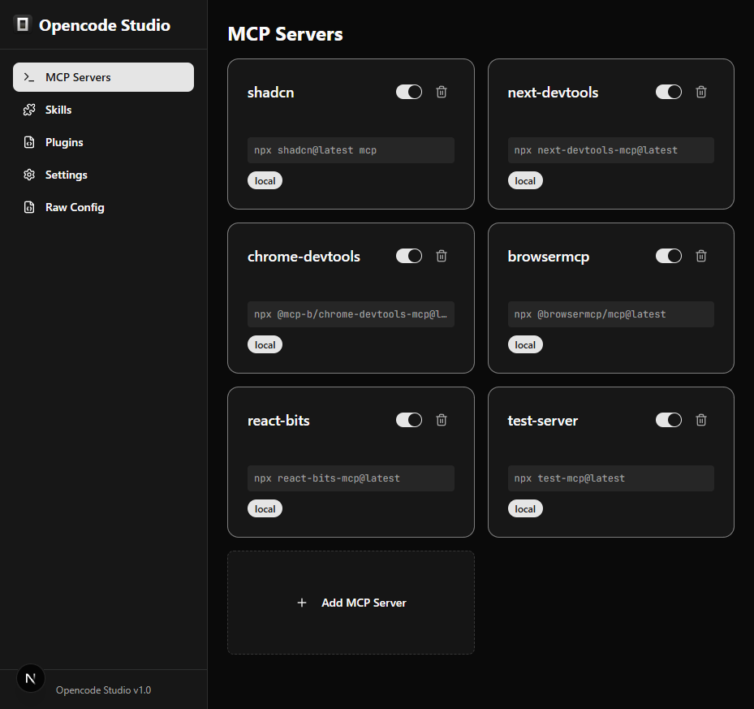
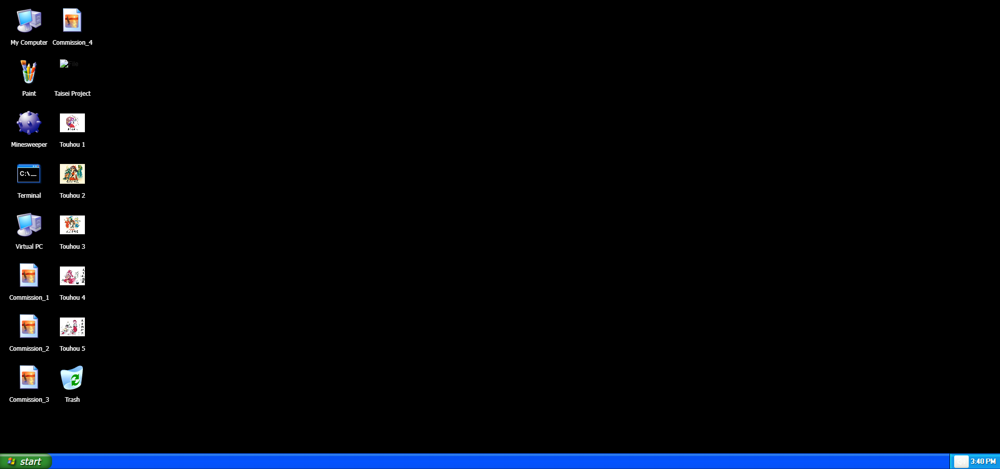
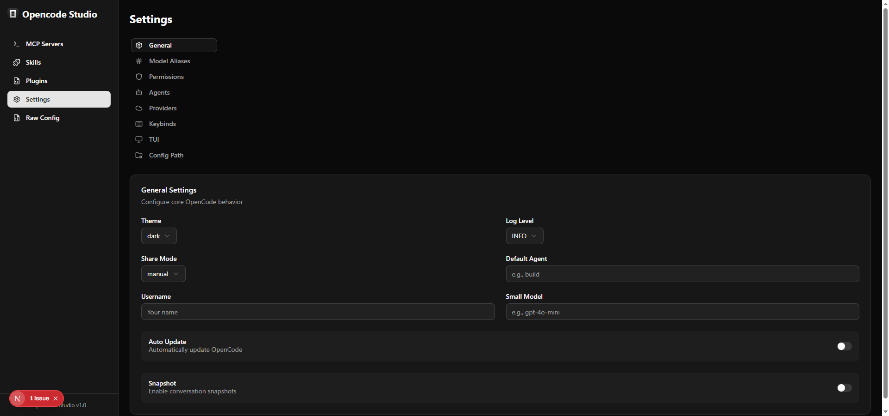

# Opencode Studio

## Overview
Opencode Studio is a local GUI application designed to manage your Opencode configurations easily. It allows you to toggle MCP servers, edit skills, and manage plugins without manually editing JSON files.

## Architecture
- **Backend**: Node.js with Express.
  - Automatically detects your `~/.config/opencode` directory.
  - API endpoints to read/write `opencode.json` and modify files in `skill/` and `plugin/` directories.
- **Frontend**: Next.js 15 with shadcn/ui and Tailwind CSS (located in `client-next`).
  - Modern dark-themed dashboard using Space Grotesk and JetBrains Mono fonts.
  - Real-time configuration updates via centralized context.

## Features
1. **MCP Manager**:
   - Visual toggle switches to enable/disable MCP servers.
   - Delete unused MCP configurations with confirmation dialogs.
   - Add new MCP servers with command parsing and environment variable support.
2. **Skill Editor**:
   - Browse and edit skills in `.config/opencode/skill`.
   - Create new skills from templates.
3. **Plugin Hub**:
   - View and edit local JS/TS plugins in `.config/opencode/plugin`.
   - Create new plugins with boilerplate templates.
4. **Settings**:
   - Manage global configuration, model aliases, permissions, and agent settings.

## Quickstart

To get up and running immediately, use the provided quickstart scripts:

**Windows:**
```batch
quickstart.bat
```

**macOS / Linux:**
```bash
chmod +x quickstart.sh
./quickstart.sh
```

## Screenshots

### MCP Manager


### Skill Editor


### Settings


## Installation & Usage

### Prerequisites
- Node.js installed.

### Setup
1. Navigate to the project directory:
   ```sh
   cd opencode-studio
   ```
2. Install dependencies:
   ```sh
   npm install
   cd client-next && npm install
   cd ../server && npm install
   ```

### Running the App
Start both the backend and frontend with a single command:
```sh
npm start
```
- **Frontend**: http://localhost:3000
- **Backend API**: http://localhost:3001
