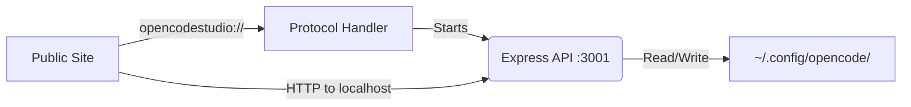
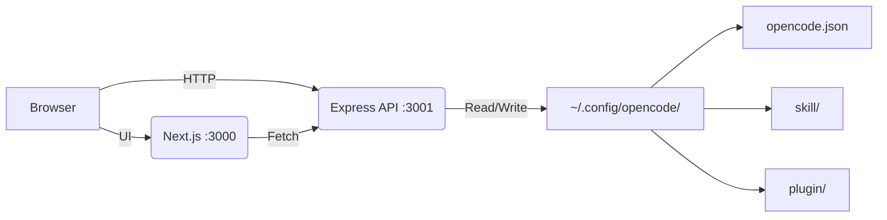

<p align="center">
  <a href="https://github.com/Microck/opencode-studio">
    
  </a>
</p>

<p align="center">a local gui for managing opencode configurations. toggle mcp servers, edit skills, manage plugins, handle auth - no json editing required.</p>

<p align="center">
  <a href="LICENSE"></a>
  <a href="https://nextjs.org/"></a>
</p>

---

### quickstart

#### option 1: public site + local backend (recommended)

1. install the backend globally:
```bash
npm install -g opencode-studio-server
```

2. visit the public site: [opencode-studio.vercel.app](https://opencode-studio.vercel.app)

3. click "Launch Backend" in the sidebar → backend starts automatically

#### option 2: fully local

**windows**
```batch
quickstart.bat
```

**macos / linux**
```bash
chmod +x quickstart.sh
./quickstart.sh
```

open http://localhost:3000

---

### features

- **mcp manager:** toggle servers on/off, add new ones by pasting npx commands, delete unused configs
- **skill editor:** browse/edit skills, create from templates, import from url, bulk import multiple urls
- **plugin hub:** manage js/ts plugins, multiple templates (hooks, watchers, lifecycle), bulk import
- **models:** configure context windows + output limits for any model, reference data for 35+ models
- **commands:** browse and manage custom slash commands
- **editor config:** customize editor settings (font, theme, keybinds)
- **auth:** view connected providers, login via oauth/api key, track token expiration
- **settings:** collapsible sections for model aliases, permissions, agents, providers, backup/restore
- **bulk import:** paste multiple urls, preview with checkboxes, skip existing items

---

### how it works

#### public mode


#### local mode


1. **detect:** server finds your opencode config directory automatically
2. **read:** loads `opencode.json`, skills, plugins, auth
3. **edit:** make changes through the ui
4. **save:** writes back to disk instantly

---

### usage

#### mcp servers
```
/mcp → toggle switches to enable/disable
     → [Add] paste npx command or configure manually
     → search/filter by name
```

#### skills
```
/skills → [New Skill] create from template
        → [Bulk Import] paste multiple urls
        → click card to edit in monaco editor
        → toggle enable/disable
```

#### plugins
```
/plugins → [New Plugin] pick template (basic, hooks, watcher, etc.)
         → [Bulk Import] paste multiple urls
         → click to edit
```

#### models
```
/models → configure context window + max output for any model
        → double-click reference model to append to prefix (e.g. copilot/)
        → 35+ reference models with specs (claude, gpt, gemini, deepseek, etc.)
```

#### commands
```
/commands → browse custom slash commands
          → view command content
```

#### editor
```
/editor → customize editor font, size, theme
        → configure vim mode, word wrap, minimap
```

#### auth
```
/auth → view connected providers
      → [Login] opens browser oauth
      → remove credentials
```

---

### bulk import

paste multiple raw github urls (one per line):
```
https://raw.githubusercontent.com/.../skills/brainstorming/SKILL.md
https://raw.githubusercontent.com/.../skills/debugging/SKILL.md
https://raw.githubusercontent.com/.../skills/tdd/SKILL.md
```

click fetch → preview table with checkboxes → existing items unchecked by default → import selected

works for both skills and plugins.

---

### project structure

```
opencode-studio/
├── client-next/           # next.js 16 frontend
│   ├── src/
│   │   ├── app/           # pages (mcp, skills, plugins, models, commands, editor, auth, settings)
│   │   ├── components/    # ui components
│   │   └── lib/           # api client, context
│   └── public/
├── server/
│   └── index.js           # express api
├── quickstart.bat
├── quickstart.sh
└── package.json           # runs both with concurrently
```

config location: `~/.config/opencode/` (auto-detected)

---

### screenshots

| mcp manager | skill editor |
|:---:|:---:|
|  |  |

| auth | settings |
|:---:|:---:|
|  |  |

---

### manual install

#### backend only (for public site)
```bash
npm install -g opencode-studio-server
opencode-studio-server
```

#### full local setup
```bash
git clone https://github.com/Microck/opencode-studio.git
cd opencode-studio

./install.sh   # or install.bat on windows
./start.sh     # or start.bat on windows
```

- frontend: http://localhost:3000
- api: http://localhost:3001

---

### troubleshooting

| problem | fix |
|:---|:---|
| "opencode not found" | ensure `~/.config/opencode/opencode.json` exists |
| port 3000/3001 in use | kill existing processes or change ports |
| skills not showing | check `~/.config/opencode/skill/` has SKILL.md files |
| bulk import fails | ensure urls are raw github links (raw.githubusercontent.com) |
| "Launch Backend" not working | run `npm install -g opencode-studio-server` first |
| protocol handler not registered | run `opencode-studio-server --register` as admin |

---

### tech stack

- **frontend:** next.js 16, tailwind css v4, shadcn/ui, geist font
- **backend:** express, node.js
- **storage:** filesystem (reads/writes opencode config directly)

---

### license

mit
