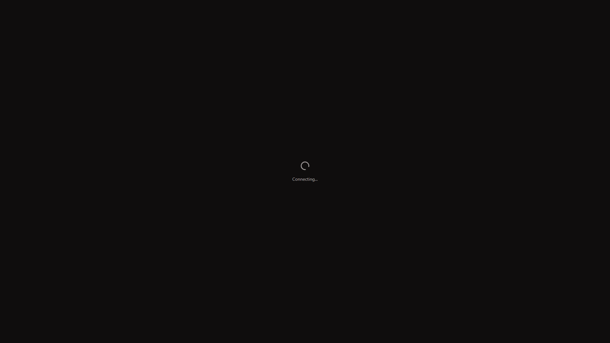
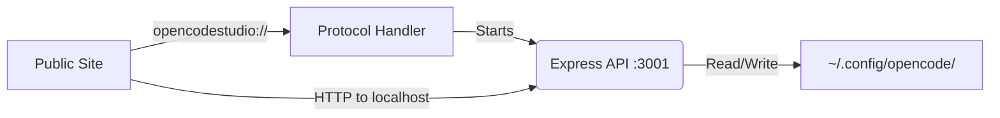
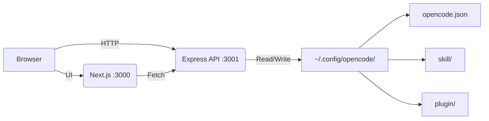
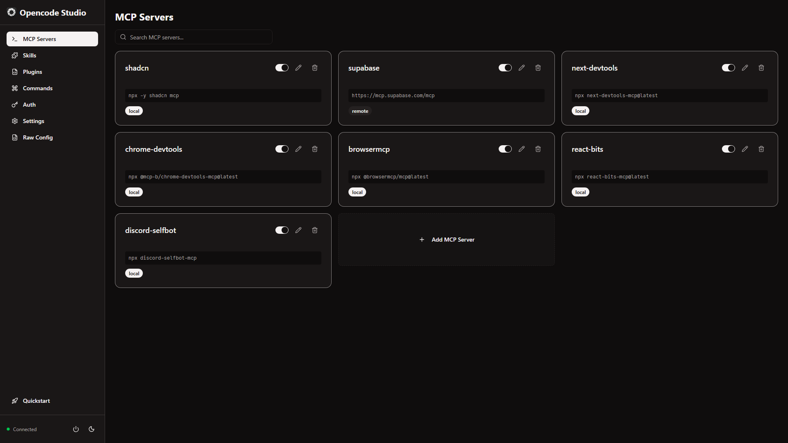
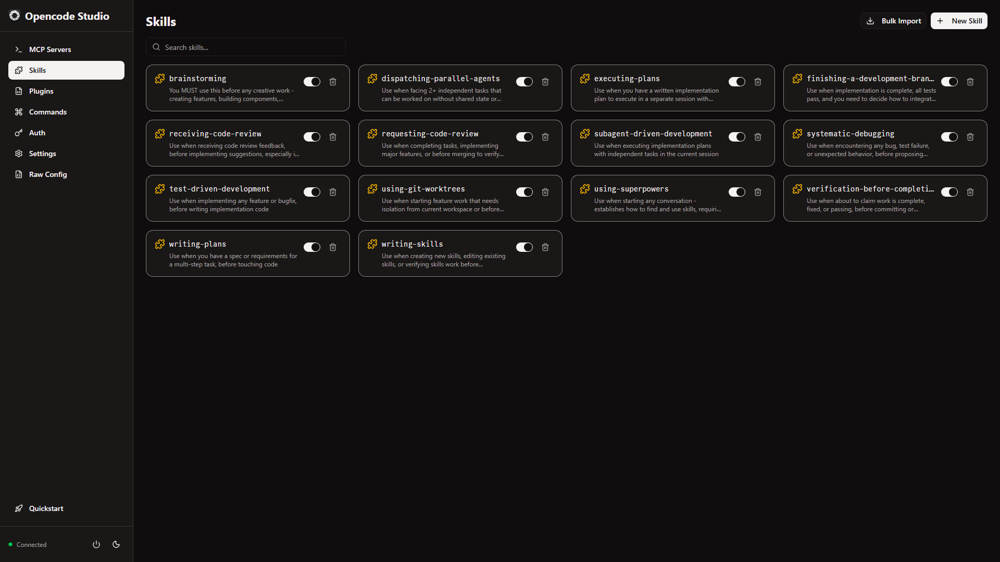
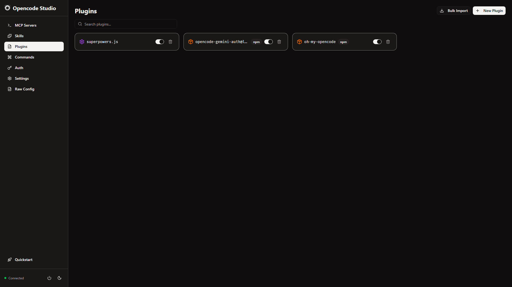
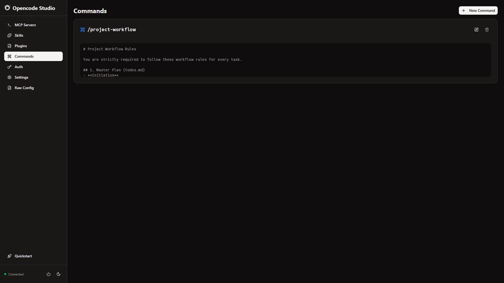
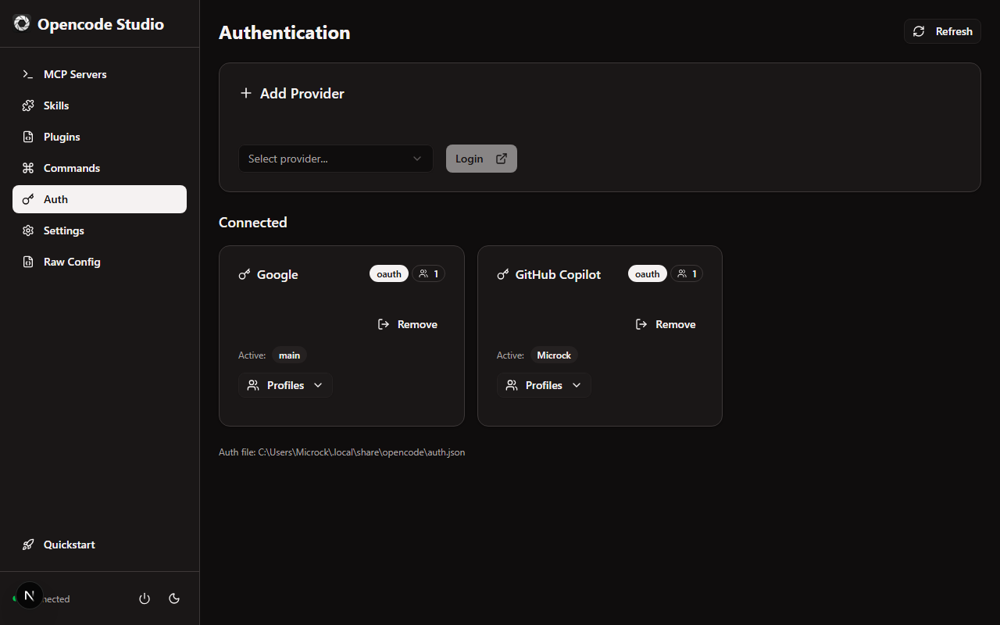
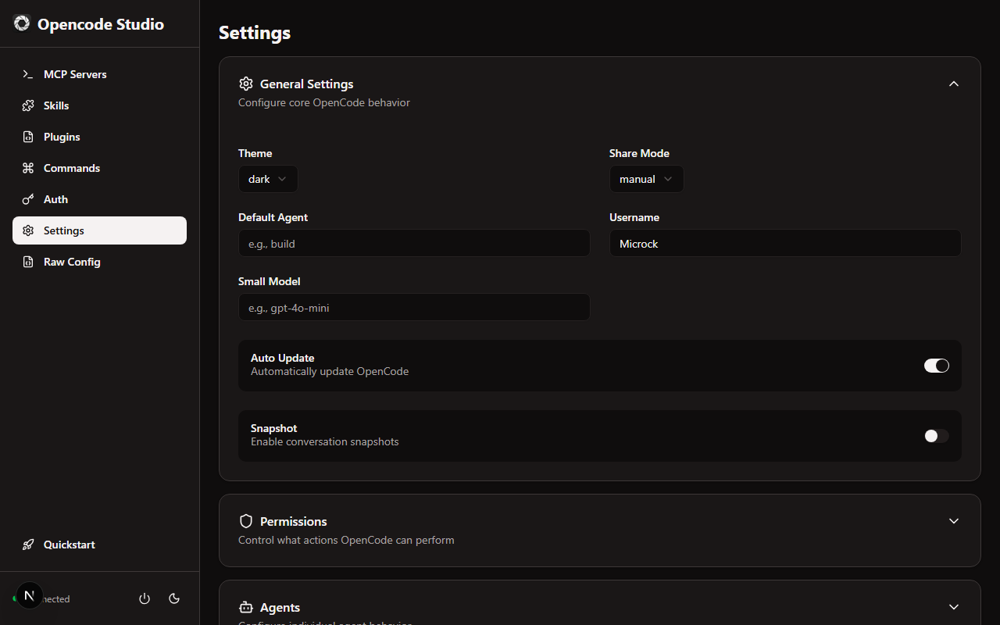
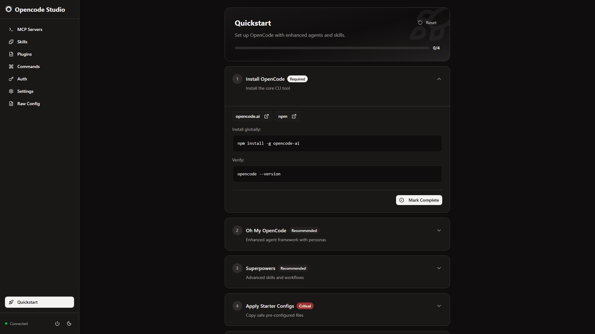

<p align="center">
  <a href="https://github.com/Microck/opencode-studio">
    
  </a>
</p>

<p align="center">a local gui for managing opencode configurations. toggle mcp servers, edit skills, manage plugins, handle auth - no json editing required.</p>

<p align="center">
  <a href="LICENSE"></a>
  <a href="https://nextjs.org/"></a>
  <a href="https://www.npmjs.com/package/opencode-studio-server"></a>
  <a href="https://opencode.micr.dev"></a>
</p>

<p align="center">
  
</p>

---

### quickstart

#### option 1: public site + local backend (recommended)

1. install the backend globally:
```bash
npm install -g opencode-studio-server
```

2. visit the public site: [opencode.micr.dev](https://opencode.micr.dev)

3. click "Launch Backend" in the sidebar - backend starts automatically

#### option 2: fully local

**windows**
```batch
quickstart.bat
```

**macos / linux**
```bash
chmod +x quickstart.sh
./quickstart.sh
```

open http://localhost:3000

---

### features

- **mcp manager:** toggle servers on/off, add new ones by pasting npx commands, delete unused configs
- **skill editor:** browse/edit skills, create from templates, import from url, bulk import multiple urls
- **plugin hub:** manage js/ts plugins, multiple templates (hooks, watchers, lifecycle), bulk import
- **commands:** browse and manage custom slash commands
- **auth:** view connected providers, login via oauth/api key, **multi-account support**, and **Gemini plugin detection**
- **settings:** permissions, agents config, keybinds, tui settings, backup/restore
- **bulk import:** paste multiple urls, preview with checkboxes, skip existing items

---

### how it works

#### public mode


#### local mode


1. **detect:** server finds your opencode config directory automatically
2. **read:** loads `opencode.json`, skills, plugins, auth
3. **edit:** make changes through the ui
4. **save:** writes back to disk instantly

---

### usage

#### mcp servers
```
/mcp → toggle switches to enable/disable
     → [Add] paste npx command or configure manually
     → search/filter by name
```

#### skills
```
/skills → [New Skill] create from template
        → [Bulk Import] paste multiple urls
        → click card to edit in monaco editor
        → toggle enable/disable
```

#### plugins
```
/plugins → [New Plugin] pick template (basic, hooks, watcher, etc.)
         → [Bulk Import] paste multiple urls
         → click to edit
```

#### commands
```
/commands → browse custom slash commands
          → view command content
```

#### auth
```
/auth → view connected providers
      → [Login] opens browser oauth
      → save multiple accounts per provider
      → switch between accounts instantly
      → rename/delete saved profiles
```

#### settings
```
/settings → permissions (edit, bash, skill, webfetch)
          → agent config (model, temperature, color)
          → keybinds (12 essential shortcuts)
          → tui settings (scroll, diff style)
          → backup/restore config
```

---

### bulk import

paste multiple raw github urls (one per line):
```
https://raw.githubusercontent.com/.../skills/brainstorming/SKILL.md
https://raw.githubusercontent.com/.../skills/debugging/SKILL.md
https://raw.githubusercontent.com/.../skills/tdd/SKILL.md
```

click fetch → preview table with checkboxes → existing items unchecked by default → import selected

works for both skills and plugins.

---

### deep links (protocol handler)

opencode studio supports deep links for one-click installs from external sites.

#### available protocols

| protocol | description |
|:---|:---|
| `opencodestudio://launch` | start backend only |
| `opencodestudio://launch?open=local` | start backend + open localhost:3000 |
| `opencodestudio://install-mcp?name=NAME&cmd=COMMAND` | install mcp server |
| `opencodestudio://import-skill?url=URL` | import skill from url |
| `opencodestudio://import-plugin?url=URL` | import plugin from url |

#### examples

**add mcp server button (for docs/repos):**
```html
<a href="opencodestudio://install-mcp?name=my-server&cmd=npx%20-y%20%40my%2Fmcp-server">
  Add to OpenCode
</a>
```

**import skill button:**
```html
<a href="opencodestudio://import-skill?url=https%3A%2F%2Fraw.githubusercontent.com%2F...%2FSKILL.md">
  Import Skill
</a>
```

**with environment variables:**
```
opencodestudio://install-mcp?name=api-server&cmd=npx%20-y%20my-mcp&env=%7B%22API_KEY%22%3A%22%22%7D
```

#### url encoding

parameters must be url-encoded:
- spaces → `%20`
- `/` → `%2F`
- `:` → `%3A`
- `{` → `%7B`
- `}` → `%7D`

#### security

when clicking deep links, users see a confirmation dialog showing:
- command to be executed (for mcp)
- source url (for skills/plugins)
- warning about trusting the source

---

### project structure

```
opencode-studio/
├── client-next/           # next.js 16 frontend
│   ├── src/
│   │   ├── app/           # pages (mcp, skills, plugins, commands, auth, settings, config)
│   │   ├── components/    # ui components
│   │   └── lib/           # api client, context
│   └── public/
├── server/
│   └── index.js           # express api
├── quickstart.bat
├── quickstart.sh
└── package.json           # runs both with concurrently
```

config locations:
- opencode config: `~/.config/opencode/` (auto-detected)
- studio data: `~/.config/opencode-studio/` (profiles, preferences)

---

### screenshots

| mcp | skills | plugins |
|:---:|:---:|:---:|
|  |  |  |

| commands | auth | settings |
|:---:|:---:|:---:|
|  |  |  |

| quickstart |
|:---:|
|  |

---

### manual install

#### backend only (for public site)
```bash
npm install -g opencode-studio-server
opencode-studio-server
```

#### full local setup
```bash
git clone https://github.com/Microck/opencode-studio.git
cd opencode-studio

./install.sh   # or install.bat on windows
./start.sh     # or start.bat on windows
```

- frontend: http://localhost:3000
- api: http://localhost:3001

---

### troubleshooting

| problem | fix |
|:---|:---|
| "opencode not found" | ensure `~/.config/opencode/opencode.json` exists |
| port 3000/3001 in use | kill existing processes or change ports |
| skills not showing | check `~/.config/opencode/skill/` has SKILL.md files |
| bulk import fails | ensure urls are raw github links (raw.githubusercontent.com) |
| "Launch Backend" not working | run `npm install -g opencode-studio-server` first |
| protocol handler not registered | run `opencode-studio-server --register` as admin |

---

### license

mit
