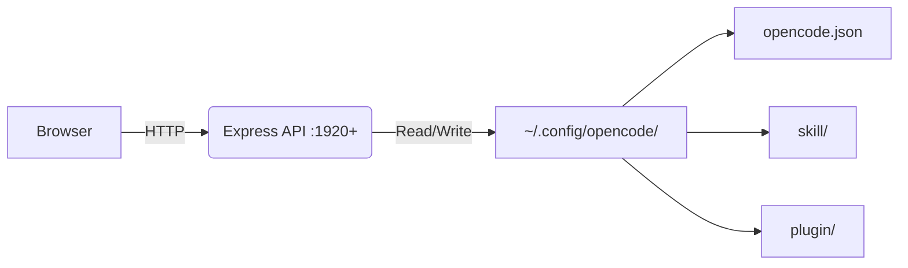

<p align="center">
  <a href="https://github.com/Microck/opencode-studio">
    
  </a>
</p>

<p align="center">a local gui for managing opencode configurations. toggle mcp servers, edit skills, manage plugins, handle auth - no json editing required.</p>

<p align="center">
  <a href="LICENSE"></a>
  <a href="https://nextjs.org/"></a>
  <a href="https://www.npmjs.com/package/opencode-studio-server"></a>
  <a href="https://www.npmjs.com/package/opencode-studio-server"></a>
<a href="https://github.com/Microck/opencode-studio">
  
</a>
</p>

<p align="center">
  
</p>

---

### quickstart

#### option 1: public site + local backend (recommended)

```bash
npm install -g opencode-studio-server
```

visit [opencode.micr.dev](https://opencode.micr.dev) and click "Launch Backend" in the sidebar.

#### option 2: fully local

**windows**
```batch
quickstart.bat
```

**macos / linux**
```bash
chmod +x quickstart.sh && ./quickstart.sh
```

open http://localhost:1080

---

### features

- **mcp manager**: toggle servers on/off, add new ones by pasting npx commands, delete unused configs
- **profiles**: isolated environments with separate configs, history, and sessions. switch instantly.
- **skill editor**: browse/edit skills, create from templates, import from url, bulk import multiple urls
- **plugin hub**: manage js/ts plugins, multiple templates (hooks, watchers, lifecycle), bulk import
- **commands**: browse and manage custom slash commands
- **usage dashboard**: token costs, model breakdown, project stats from local message logs
- **auth**: login/logout per provider, save and switch between credential profiles
- **github sync**: push/pull config to a private github repo via `gh` cli
- **backup/restore**: export/import complete config including skills and plugins
- **settings**: general config, system prompt editor, oh my opencode model preferences

---

### how it works



1. **detect**: server finds your opencode config directory automatically
2. **read**: loads opencode.json, skills, plugins, auth
3. **edit**: make changes through the ui
4. **save**: writes back to disk instantly

---

### usage

| route | actions |
|:---|:---|
| `/mcp` | toggle switches, add via npx command, search/filter |
| `/profiles` | create/switch isolated environments |
| `/skills` | create from template, bulk import, edit in monaco |
| `/plugins` | pick template, bulk import, click to edit |
| `/commands` | browse custom slash commands |
| `/usage` | token costs, model breakdown, project stats |
| `/auth` | login/logout, save/switch credential profiles |
| `/settings` | general, system prompt, github sync, oh my opencode models |

---

### bulk import

paste multiple raw github urls (one per line):

```
https://raw.githubusercontent.com/.../skills/brainstorming/SKILL.md
https://raw.githubusercontent.com/.../skills/debugging/SKILL.md
https://raw.githubusercontent.com/.../skills/tdd/SKILL.md
```

click fetch → preview with checkboxes → existing items unchecked → import selected

---

### deep links

opencode studio supports deep links for one-click installs from external sites.

> **note**: github blocks custom protocols like `opencodestudio://` in user content. use a redirect page on github pages to bypass this.

| protocol | description |
|:---|:---|
| `opencodestudio://launch` | start backend only |
| `opencodestudio://launch?open=local` | start backend + open localhost:1080+ |
| `opencodestudio://install-mcp?name=NAME&cmd=COMMAND` | install mcp server |
| `opencodestudio://import-skill?url=URL` | import skill from url |
| `opencodestudio://import-plugin?url=URL` | import plugin from url |

#### examples

**add mcp server button (for docs/repos):**
```html
<a href="https://github.com/Microck/opencode-studio">
  
</a>
```

**import skill button:**
```html
<a href="opencodestudio://import-skill?url=https%3A%2F%2Fraw.githubusercontent.com%2F...%2FSKILL.md">
  Import Skill
</a>
```

**with environment variables:**
```
opencodestudio://install-mcp?name=api-server&cmd=npx%20-y%20my-mcp&env=%7B%22API_KEY%22%3A%22%22%7D
```

#### url encoding

parameters must be url-encoded:
- spaces → `%20`
- `/` → `%2F`
- `:` → `%3A`
- `{` → `%7B`
- `}` → `%7D`

#### security

when clicking deep links, users see a confirmation dialog showing the command or url and a warning about trusting the source.

---

### project structure

```
opencode-studio/
├── client-next/           # next.js 16 frontend
│   ├── src/app/           # pages (mcp, profiles, skills, plugins, auth, settings, usage)
│   ├── src/components/    # ui components
│   └── public/            # static assets
├── server/
│   └── index.js           # express api
├── quickstart.bat
├── quickstart.sh
└── package.json           # runs both with concurrently
```

config locations:
- opencode config: `~/.config/opencode/`
- studio data: `~/.config/opencode-studio/`
- profiles: `~/.config/opencode-profiles/`

---

### troubleshooting

| problem | fix |
|:---|:---|
| "opencode not found" | ensure `~/.config/opencode/opencode.json` exists |
| port conflicts | both services auto-detect available ports (backend 1920+, frontend 1080+) |
| skills not showing | check `~/.config/opencode/skill/` has SKILL.md files |
| bulk import fails | ensure urls are raw github links |
| "Launch Backend" not working | run `npm install -g opencode-studio-server` first |
| protocol handler not registered | run `opencode-studio-server --register` as admin |
| github sync not working | run `gh auth login` first |

---

### license

mit
