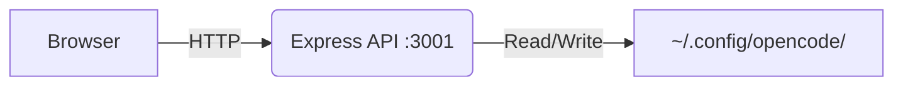

<p align="center">
  <a href="https://github.com/Microck/opencode-studio">
    
  </a>
</p>

<p align="center">a local gui for managing opencode configurations. toggle mcp servers, edit skills, manage plugins, handle auth - no json editing required.</p>

<p align="center">
  <a href="LICENSE"></a>
  <a href="https://nextjs.org/"></a>
</p>

---

### quickstart

#### option 1: public site + local backend (recommended)

1. install the backend globally:
```bash
npm install -g opencode-studio-server
```

2. visit [opencode-studio.vercel.app](https://opencode-studio.vercel.app)

3. click "Launch Backend" - backend starts automatically

#### option 2: fully local

```bash
# windows
quickstart.bat

# macos / linux
./quickstart.sh
```

open http://localhost:3000

---

### features

- **mcp manager:** toggle servers on/off, add new ones, delete unused configs
- **skill editor:** browse/edit skills, create from templates, import from url, bulk import
- **plugin hub:** manage js/ts plugins, multiple templates, bulk import
- **models:** configure context windows + output limits, 35+ reference models
- **commands:** browse custom slash commands
- **editor config:** font, theme, vim mode, keybinds
- **auth:** view providers, oauth login, token expiration
- **settings:** model aliases, permissions, agents, providers, backup/restore

---

### how it works



1. server finds your opencode config directory
2. loads `opencode.json`, skills, plugins, auth
3. make changes through the ui
4. writes back to disk instantly

---

### deep links

one-click installs from external sites:

| protocol | description |
|:---|:---|
| `opencodestudio://launch` | start backend |
| `opencodestudio://install-mcp?name=X&cmd=Y` | install mcp server |
| `opencodestudio://import-skill?url=X` | import skill |
| `opencodestudio://import-plugin?url=X` | import plugin |

example button for docs:
```html
<a href="opencodestudio://install-mcp?name=my-server&cmd=npx%20-y%20%40my%2Fmcp-server">
  Add to OpenCode
</a>
```

---

### screenshots

| mcp manager | skill editor |
|:---:|:---:|
|  |  |

| auth | settings |
|:---:|:---:|
|  |  |

---

### troubleshooting

| problem | fix |
|:---|:---|
| "opencode not found" | ensure `~/.config/opencode/opencode.json` exists |
| port 3000/3001 in use | kill existing processes |
| "Launch Backend" not working | run `npm install -g opencode-studio-server` first |
| protocol handler not registered | run `opencode-studio-server --register` as admin |

---

### license

mit
